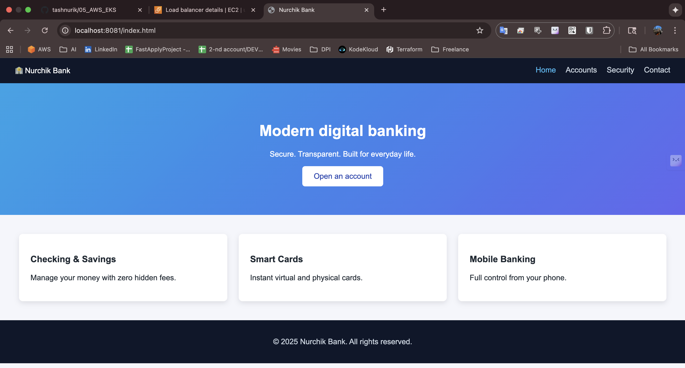
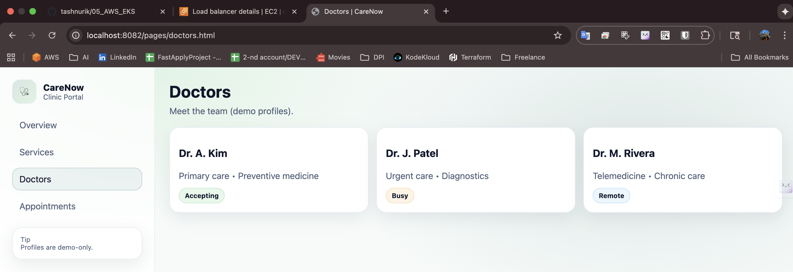
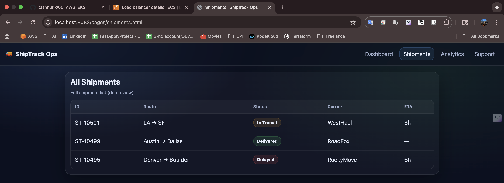

## Running the Websites with Docker

Each website is containerized independently using **Docker + Nginx**.
Make sure Docker is installed and running on your machine.

### Digital Bank
cd digital-bank
docker build -t nurchik-bank:1.0 .
docker run -d --name nurchik-bank -p 8081:80 nurchik-bank:1.0

Open: http://localhost:8081

### Healthcare portal
cd healthcare
docker build -t nurchik-health:1.0 .
docker run -d --name nurchik-health -p 8082:80 nurchik-health:1.0

Open: http://localhost:8082

### Logistics
cd logistics
docker build -t nurchik-logistics:1.0 .
docker run -d --name nurchik-logistics -p 8083:80 nurchik-logistics:1.0

Open: http://localhost:8083

### Stop and delete containers
docker stop nurchik-bank nurchik-health nurchik-logistics
docker rm nurchik-bank nurchik-health nurchik-logistics
